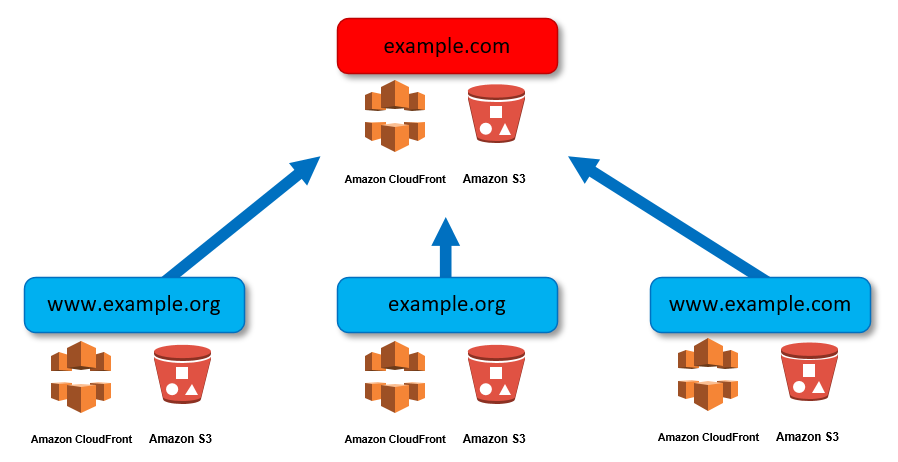
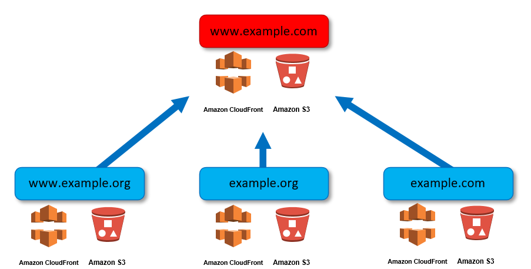

# terraform-aws-s3-static-site

[](https://circleci.com/gh/tiguard/terraform-aws-s3-static-site/tree/development)

Creates a static website on a domain hosted on S3 and delivered by CloudFront over HTTPS with Route53 managing DNS.

## Features

* Redirects the following to the primary domain `https://example.com`
  * `http://example.com`
  * `http://www.example.com`
  * `https://www.example.com`
* If further domains are specified (*i.e.* `example.org`), also redirects the following to the primary domain
  * `http://example.org`
  * `http://www.example.org`
  * `https://www.example.com`
* The raw S3 buckets are not publicly accessible.
* A single certificate is issued by the Amazon Certificate Manager for all specified domains - both apex and www.
* An IAM user named like `domain.name-deploy` is created that is given deployment access to the S3 bucket containing the site data.
* The primary domain can be either `https://example.com` or `https://www.example.com`.

### Primary domain is apex



### Primary domain is www



## Usage

```hcl
provider "template" {
    version = "~> 1.0"
}

provider "aws" {
    alias  = "use1"
    region = "us-east-1"
}

module "s3_static_site" {
    source    = "vexingcodes/s3-static-site/aws"
    countries = ["RU", "CN"]
    secret    = "secret cdn user agent pseudo-password"

    domains = [
        "example.com",
        "example.org",
        "example.net"
    ]

    cdn_settings = {
        price_class              = "PriceClass_100"
        restriction_type         = "blacklist"
        minimum_protocol_version = "TLSv1.2_2018"
    }
```

The module requires the `template` provider and an alias for the `aws` provider called `use1`.

## Inputs

* `domains` is a list of naked domains to be built into a static website with a CloudFront front-end.
* `secret` is the key that is shared between CloudFront and S3 to authorize access.
* `www_is_main` controls whether the apex domain or the www subdomain is the main site.
* `enable_iam_user` controls whether the module should create the AWS IAM deployment user.
* `cdn_settings` is a map containing some configurable CloudFront settings.  These are optional and have sane defaults.
  * `price_class` - sets the CloudFront [price class](https://docs.aws.amazon.com/AmazonCloudFront/latest/DeveloperGuide/PriceClass.html).  Defaults to `PriceClass_All`.
  * `restriction_type` - set the [geographic restriction](https://docs.aws.amazon.com/AmazonCloudFront/latest/DeveloperGuide/georestrictions.html) type.  Defaults to `none`.  If this is set, the `countries` variable should be set also.
  * `minimum_protocol_version` - sets the minimum version of TLS that CloudFront will require.  See the AWS CloudFront [documentation](https://docs.aws.amazon.com/AmazonCloudFront/latest/DeveloperGuide/secure-connections-supported-viewer-protocols-ciphers.html#secure-connections-supported-ciphers) for a full list.  Defaults to `TLSv1_2016`.
  * `min_ttl` - the minimun time-to-live for content in seconds.  Defaults to `0`.
  * `default_ttl` - the default amount of time, in seconds, that objects stay in CloudFront cache before CloudFront requests an updated copy.  Defaults to 1 day.
  * `max_ttl` - the maximum amount of time, in seconds, that objects stay in CloudFront cache.  Defaults to 1 year.  Further details of all the TTL settings can be found in the AWS CloudFront [documentation.](https://docs.aws.amazon.com/AmazonCloudFront/latest/DeveloperGuide/Expiration.html)
* `countries` is a list of countries in [ISO 3166-alpha-2 country code](https://en.wikipedia.org/wiki/ISO_3166-1_alpha-2#Officially_assigned_code_elements) format that the CloudFront `restriction_type` applies to.

## Outputs

There are two outputs, an AWS access key/secret that can be used to deploy to the site's S3 bucket and the name of the primary S3 bucket.

## Details

Multiple S3 buckets are created, one main bucket for `example.com` or `www.example.com` (depending on how `www_is_main` is set) which will hold all of the site data and the others for for `www.domain.name` which is simply a bucket set up to redirect to the first bucket.

A Route 53 hosted zone is created for `domain.name`, and a certificate is issued for `domain.name` and `www.domain.name` by automatically adding the appropriate `CNAME` records to the hosted zone. Then the module waits for the certificate to actually be issued. See the notes section for troubleshooting.

Two CloudFront distributions are created, one for `domain.name` and one for `www.domain.name`. Each of them simply points at the respective S3 bucket and uses the certificate created in the previous step.

Once the CloudFront distributions are available, then the `A` records are created in Route 53 for `domain.name` and `www.domain.name`. The `A` records are simply `ALIAS` records to the respective CloudFront distributions.

Finally, an IAM user is created, an access key is given to this user, and a policy is attached to the user that only allows the user to modify the `domain.name` S3 bucket.

## Notes

The certificate is created automatically by adding DNS entries to the Route 53 hosted zone. The script will wait up to two hours for the certificate to be issued. If your domain is not owned by Route 53, you may need to go to the Route 53 hosted zone, look at the NS record, and assign your domain those nameservers. If the script times out because this was not done rerunning `terraform apply` after making sure the nameservers are correct should allow the module to continue.
